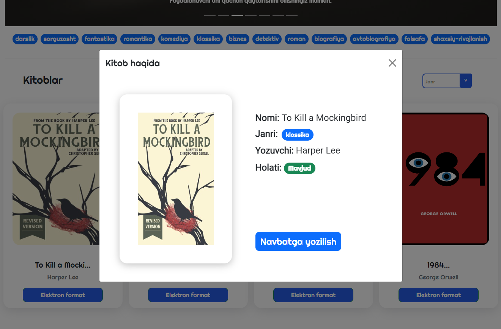

# Library management application

### The app is designed to be used for management and make both librarians' and readers' lives easier by displaying information about various books using brief descriptions, their availability and genres. 
### The app also has an administrator panel, which is used by librarians to keep track of books, and used to remove and add books. 
## Demo Showcase
#### - Homepage

#### - List of books in homepage

#### - Book details

#### - List of reservations of student

#### - Adding a book in librarian(admin) panel

#### - List of books in librarian(admin) panel

#### - List of reservation requests in librarian(admin) panel

#### The app is made using: 
- `"Express"`, a simple but efficient backend framework;
- `"Mongo"`, a versatile non-SQL database technology; 
- `"React"`, a "reactive" and popular UI library; 
- `"JWT"`, also known as "JSON Web Token" library for user authentication;
- `"Bcrypt"`, library to cipher the password;
- `"Monk"`,  package to build a connection with database;
- `"Nanoid"` node package, for making unique identifiers on the run;

### The features of our app are quite simple:
- Users can sign up using their email and password; 
- The system will cihper the password; 
- Give the user a unique identifier
- Store the information in the database. 
### So even if the database was breached and data was stolen, the breachers wouldn't get the actual password and all they would end up with would be *a randomized identifier* and *a hashed cipher*. 
### After signing up, you are able to log in and wishlist (or request) for books you like or search for the book of your desires. 
#### There are also pre-made admin accounts, which have access to the administrator panel. On the admin panel, moderators are able to add, remove and edit certain information, as well as keeping track of books by checking who has taken the book. They also approve users' requests for books.
  
### The app is made for a local hackathon, within 3 days. We spent the first day planning the architecture of the application, second day applying the simple backend architecture and last day to implement the user authentication, perfect UI and UX of the web app and deploy it on the cloud.
---

## Available Scripts

In the project directory, you can run:

### `yarn start`

Runs the app in the development mode.\
Open [http://localhost:3000](http://localhost:3000) to view it in the browser.

The page will reload if you make edits.\
You will also see any lint errors in the console.

### `yarn build`

Builds the app for production to the `build` folder.\
It correctly bundles React in production mode and optimizes the build for the best performance.

The build is minified and the filenames include the hashes.\
Your app is ready to be deployed!

See the section about [deployment](https://facebook.github.io/create-react-app/docs/deployment) for more information.